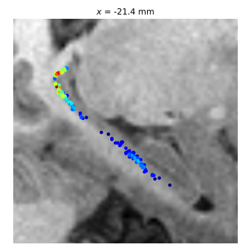
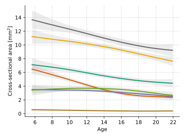
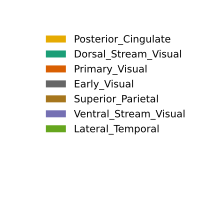
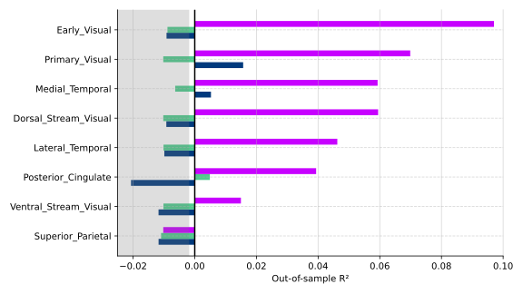

## Abstract
Fiber-tracts exhibit different projection patterns along the anterior–posterior axis of the hippocampus, promoting a specialization in function. This specialization becomes increasingly pronounced throughout child development, with important implications for neurocognitive outcomes. Developmental changes in the strength of these fiber-tracts, including their cross-sectional area and myelin-content, reflect a potential mechanism for this functional specialization. To test this, we developed a diffusion-MRI tractography pipeline to map hippocampal fiber-tracts in single subjects, then examined whether age-related differences in intra-axonal cross-sectional area and myelin-content (T1w/T2w) could predict functional specialization in a large cross-sectional sample (N=539, aged 5–21). With age, we found that the cross-sectional area of short-range medial-temporal tracts, which primarily target the anterior/body of the hippocampus, exhibited rapid growth. Concomitantly, the cross-sectional area of long-range occipito-parietal tracts, which primarily target the posterior hippocampus, exhibited a modest pruning. Increases in myelin-content were relatively homogenous across fiber-tracts. In support of our hypothesis, we found that the cross-sectional area of fiber-tracts could significantly predict the surface-area of an fMRI-defined posterior system; a sensitive marker of functional specialization in the hippocampus. Tracts targeting early-visual occipital cortex (V2, V3, V4) exhibited the strongest effect, with statistical modeling indicating a mediating effect of early-visual tract development on the relationship between age and functional specialization. This is a crucial step towards a mechanistic understanding of how anatomical neurodevelopment influences hippocampal function.

### Long-range occipital-parietal fiber-tracts primarily target the posterior hippocampus.

<table>
  <tr>
    <td align="center">
       
      Hippocampal surface
    </td>
    <td align="center">
       
      Sagittal T1 slice
    </td>
  </tr>
</table>

### Occipital-parietal fiber-tracts tracts show slight pruning with development.

<table>
  <tr>
    <td align="center">
       
    </td>
    <td align="legend">
       
    </td>
  </tr>
</table>

### The size of the posterior functional system is predicted by the cross-sectional area of hippocampal fiber tracts.

<table>
  <tr>
    <td align="center">
       
    </td>
  </tr>
</table>

